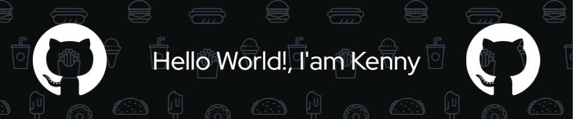

<h2 align="center">Hey there 👋, I'm Kenny</h2>

🚀 Informatics Engineering Student | Web Dev Enthusiast | DevOps Learner

---

<h3 align="center">💡 Tech Stack</h3>

  

<h3 align="center">📦 Additional Tools</h3>

  
  
  
  

---

<h3 align="center">📈 GitHub Stats</h3>

  
  

